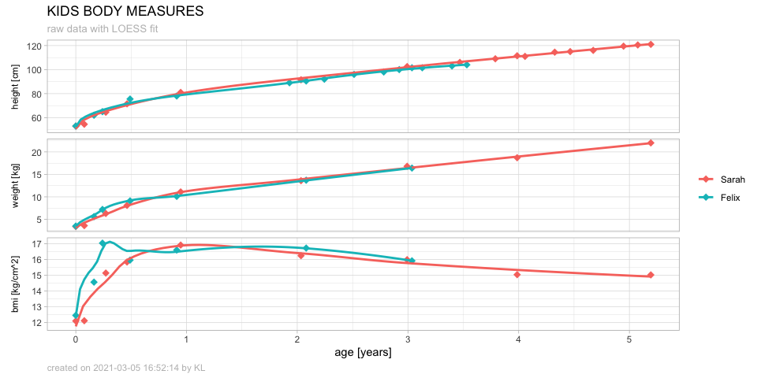

# Kids Body Measures

Visualization of the body measurements of our children

<div>

by <a href="mailto:firstname.lastname [@] outlook.com">Konstantin “Karl
Komet” Lang</a> on 2021-03-05 16:52:13

</div>

``` r
measures %>% 
  ggplot(mapping = aes(x = age, y = value, color = child, fill = child)) +  
  facet_grid(name ~ ., scales = "free", space = "free_x", switch = "y") + 
  geom_point(shape = 18, size = 3) + 
  geom_smooth(method = loess, formula = y ~ sqrt(x), se = FALSE, alpha = 0.7) + 
  # scale_y_log10() + 
  # scale_x_continuous(trans = "pseudo_log", breaks = 0:100, minor_breaks = 0:99 + 0.5) + 
  labs(
    y = NULL, color = NULL, fill = NULL, 
    x = "age [years]",
    title = "KIDS BODY MEASURES",
    subtitle = "raw data with LOESS fit",
    caption = paste("created on", Sys.time(), "by KL")
  ) + 
  theme_light() + 
  theme(
    strip.placement  = "outside",
    strip.background = element_rect(fill = "white"),
    strip.text       = element_text(colour = "black"),
    legend.position  = "right",
    plot.subtitle    = element_text(size = 10, color = "gray"),
    plot.caption     = element_text(hjust = 0, color = "gray")
  )
```


